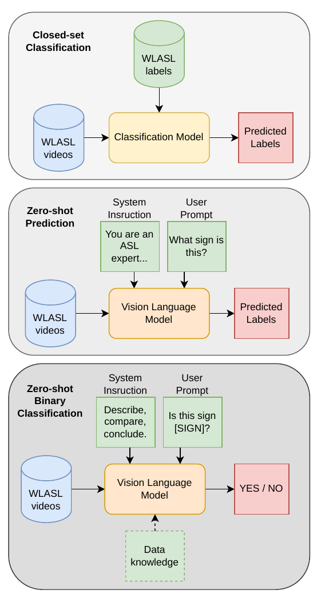

# WLASL_LLM

Repository accompanying the paper [**Sign Language Recognition in the Age of LLMs**](https://arxiv.org/abs/2604.11225).

The repository has two main goals:

1. Showcase the experiments and conclusions of the paper.
2. Provide a practical set of runnable tools for applying modern LLMs/VLMs to sign language videos, mainly on the `WLASL300` benchmark.



*Figure 1. Evaluation paradigms studied in the paper: closed-set classification, direct zero-shot gloss prediction, and binary sign matching with optional dataset knowledge.*

## Repository Layout

| Path | Purpose |
| --- | --- |
| `inference/local/` | Local open-source model runners used in the paper, including Qwen, LLaVA-NeXT-Video, InternVL, and BAGEL scripts. |
| `inference/frontier/` | API-based runners for proprietary models such as GPT-5 and Gemini. |
| `inference/frontier/corrections/` | Retry and correction scripts for failed or empty frontier-model responses. |
| `analysis/` | Evaluation and output-analysis scripts, including exact-match evaluation and prediction-distribution analysis. |
| `frame_selection/` | Supporting utilities and experiments for selecting informative frames from sign videos. |
| `gloss_descriptions/` | Supporting resources for collecting and preparing gloss descriptions used in prompting experiments. |
| `assets/` | Small repository assets used in the documentation, including the figure shown above. |
| `environment_qwen25.yaml`, `environment_qwen3.yaml` | Example environments for local model execution. |

The codebase is intentionally script-first rather than a packaged library. Each runner script loads one model family, performs inference on sign videos, and writes predictions for later evaluation.

Local `models/` checkpoints and generated `output/` artifacts are expected by several scripts, but those directories are git-ignored and are therefore not part of the GitHub repository layout.

## Preparing WLASL

The repository does not currently download or reorganize WLASL automatically. The scripts expect a local `WLASL300`-style layout with the metadata JSON and the test videos arranged by gloss index:

```text
<WLASL300_ROOT>/
├── WLASL_v0.3.json
└── test/
    ├── 0/
    │   ├── <video_id>.mp4
    │   └── ...
    ├── 1/
    │   ├── <video_id>.mp4
    │   └── ...
    └── ...
```

The numeric folder names under `test/` are expected to correspond to the index of the gloss entry in `WLASL_v0.3.json`, because the scripts iterate over the JSON entries and look for videos in folders named `0`, `1`, `2`, and so on.

In practice, preparation is:

1. Download the WLASL metadata file `WLASL_v0.3.json` and the corresponding videos.
2. Build the `test/<gloss_index>/<video_id>.mp4` structure for the `WLASL300` subset you want to evaluate.
3. Update `videos_path` to point to the `test/` directory and `json_file_path` to point to `WLASL_v0.3.json` in the script you want to run.
4. For local open-source models, place the required checkpoints into the local `models/` paths expected by the scripts.

## Running the Repository

Run the scripts from the repository root.

Examples:

```bash
python inference/local/Qwen-25-VL_inference.py
python inference/frontier/GPT-5_inference.py --api-key YOUR_OPENAI_KEY
python analysis/evaluate_predictions.py output/your_predictions.csv
python analysis/analyze_prediction_distribution.py output/your_predictions.csv
```

For frontier/API models, install the relevant SDKs such as `openai` and `google-genai`. If API runs produce empty or failed outputs, use the retry scripts under `inference/frontier/corrections/`.

## Scope

The focus of the repository is zero-shot isolated sign language recognition with modern multimodal models. The code mirrors the experimental setups from the paper and is intended to make those experiments easy to inspect, reproduce, and extend.

## Paper

Paper: [**Sign Language Recognition in the Age of LLMs**](https://arxiv.org/abs/2604.11225)